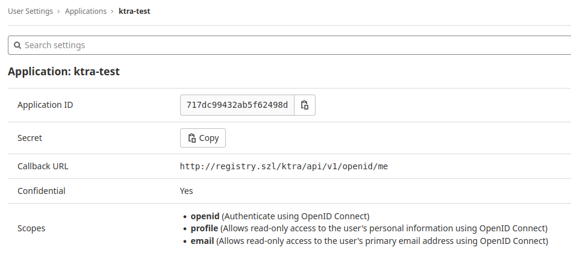
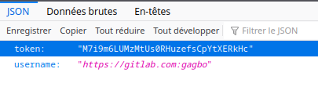
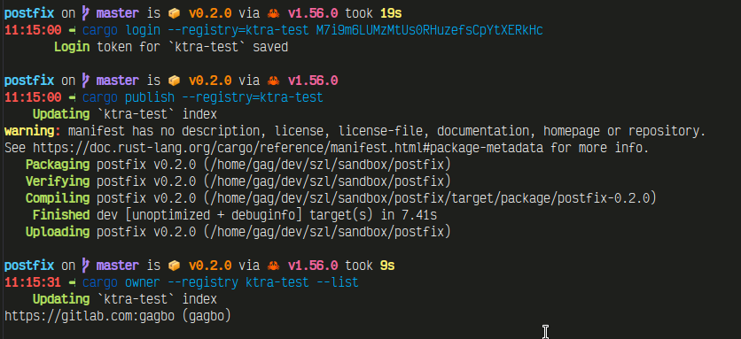

# OpenId Service Provider registration

> ***Warning***:  
> The support of OpenID is experimental, and only confirmed to work well with
> Gitlab as the Identity Provider.

> ***Note***:  
> A user who can "login" to the registry only gains the right to own crates on
> the registry, and call the associated `cargo publish`, `cargo yank`, and
> `cargo owner --add/--remove` APIs. You do _not_ need to be logged in, in the
> `cargo login` sense, to pull crates from the registry; just as users in
> general do not need to run `cargo login` before being able to pull crates from
> `crates-io` like `serde`.

## Prerequisites

To be able to use OpenId for authentication you need to know which Identity
Provider (IP) you want to use, and that Identity Provider needs to have the following
properties:

- you must be able to register a new application to it (obtaining a client ID
  and a client secret),
- the IP must have a [discoverable
  configuration](https://openid.net/specs/openid-connect-discovery-1_0.html#ProviderConfig)
  (through `GET /.well-known/openid-configuration`), and
- the discovered configuration must have a `userinfo_endpoint`.

For example, using a tool like [jq](https://stedolan.github.io/jq/), checking that
Gitlab is valid is as easy as:
```
$ curl https://gitlab.com/.well-known/openid-configuration 2>/dev/null | jq ".userinfo_endpoint"
"https://gitlab.com/oauth/userinfo"
```

And an example of a provider that won't work:
```
$ curl https://github.com/.well-known/openid-configuration 2>/dev/null | jq ".userinfo_endpoint"
parse error: Invalid numeric literal at line 1, column 4
```

> ***Note***:  
> The feature has been fully implemented and tested thoroughly with Gitlab as
> the IP. The aim is to have OpenID support for all providers that meet the
> above criteria, so you **might** encounter issues with other IP, and
> contributions (issue reports, patches...) are welcome to help with the
> coverage.

If you want to use a provider that is not Gitlab, check the API documentation of
the `userinfo` endpoint to see which claims you need to obtain. For example,
Gitlab API documentation says
[here](https://docs.gitlab.com/ee/integration/oauth_provider.html#authorized-applications)
that extra profile information might require the `profile` and `email` claims,
explaining why it shows later in the configuration.

From now on, all the steps will have pictures and steps specific to using Gitlab
as the IP, to give a concrete, working example.

## Setting up Ktra as Service Provider (SP)

Most of the time, adding Ktra as a SP will go as "Adding an application" menu
for the IP. Here for gitlab, we are adding an application:

- with the required "scopes" (matching the claims we found necessary for the
  `userinfo` endpoint), and
- with 1 or 2 redirect URLs depending on whether you want to allow revoking
  tokens (2 is recommended):
  + `${BASE_URL}/ktra/api/v1/openid/me` is mandatory to support `cargo login`
  + `${BASE_URL}/ktra/api/v1/openid/replace_token` is optional, but will allow
    to use an endpoint to replace your saved token with a new one, effectively
    revoking the old one (useful when one token leaks)
    
When doing it with Gitlab, we end up on a screen looking like this (note that
there is only 1 URL registered in this example):



Take note of the `client_id` and `client_secret` to go to the next steps.

> ***Note***:  
> With Ktra, a user can only have a single active token. That means using `cargo
> login` multiple times (or going to the `/me` endpoint) will always return the
> same, existing token if the user already went through a first login.

## Extra Ktra configuration

The client id and secret are used in the extra `[openid_config]` section in the
TOML configuration of ktra (you can also use the equivalent commandline argument
if you prefer).

As the implementation has been more fleshed out with Gitlab, only Gitlab allows
some extra relevant confguration variables related to authorization:
- `gitlab_authorized_groups` contains a list of the groups allowed to login on
  the registry
- `gitlab_authorized_users` contains a list of logins allowed to login on the
  registry

A user needs to be at least in one authorized list to be allowed, and if both
configuration variables are absent or empty, then everyone will be able to
login.

```toml
[openid_config]
issuer_url = "https://gitlab.com"
# This needs to match the ${BASE_URL} or the IP will refuse to authenticate users because of mismatch in the
# redirect URLs
redirect_url = "http://registry.szl"
client_id = "717dc...."
client_secret = "[redacted]"
# The scopes come from checking the documentation of the userinfo_endpoint
additional_scopes = ["openid", "profile", "email"]
# Using groups allow to synchronize authorizations with an external group of users.
gitlab_authorized_groups = [ "firm/groups/crate_owners" ]
# If/When gitlab allows technical accounts, this is the best place to put a bors-like username,
# to be able to authorize crate publishing only from some CI pipeline or using webhooks.
gitlab_authorized_users = [ "gagbo" ]
```

## Logging in

Using `cargo login` with the correct registry name will prompt you to go the
`/me` [endpoint](../ktra-web-apis.md), where you will start an authentication
flow with the Identity provider until you arrive at a json payload containing
the token (the exact name and values are different in the screenshot and in the
documentation, the documentation here in the book is correct.)



## Pushing a crate

You can then use `cargo publish` to publish crates!



## Appendix: adding IP-specific support

The ability to work on extra information like the group a Gitlab user belongs to
comes from a deserializable struct in Ktra's openid handling code:

```rust
/// The additional claims OpenId providers may send
///
/// All fields here are options so that the extra claims are caught when presents
#[cfg(feature = "openid")]
#[derive(Debug, Clone, Deserialize, Serialize)]
pub struct Claims {
    pub(crate) sub: Option<String>,
    pub(crate) sub_legacy: Option<String>,
    // Gitlab claims return the groups a user is in.
    // This property is used when gitlab_authorized_groups is set in the configuration
    pub(crate) groups: Option<Vec<String>>,
}
```

If extra info is returned by the IP and necessary later to implement
authorization logic, it should start from there, to be later used in the
callback handler in such fashion:
```
if let Some(ref auth_groups) = openid_config.gitlab_authorized_groups {
        if let Some(ref groups) = userinfo.additional_claims().groups {
            for group in groups {
                if auth_groups.contains(group) {
                    tracing::info!("matched authorized group {}, authorizing.", group);
                    return true;
                }
            }
        }
    }
```
